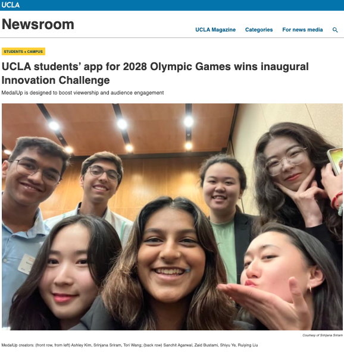
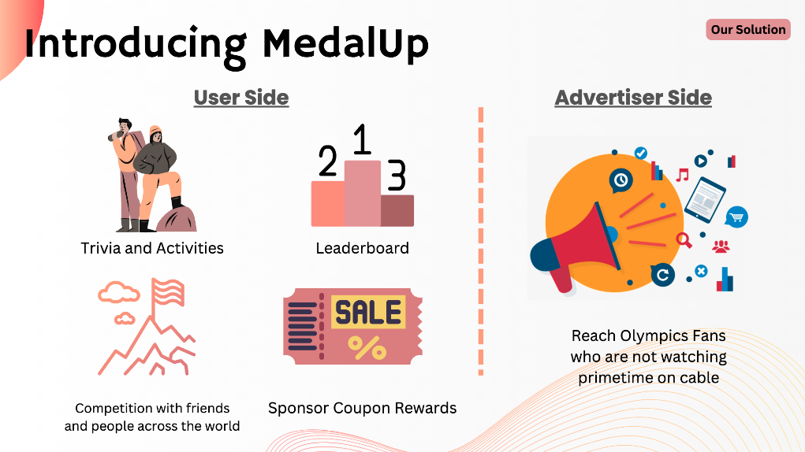
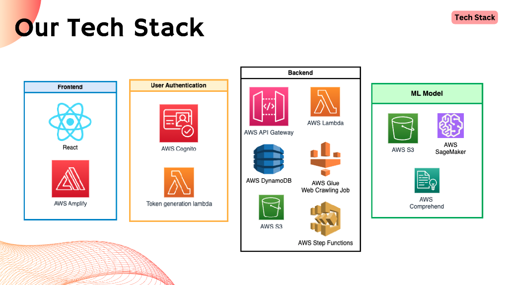
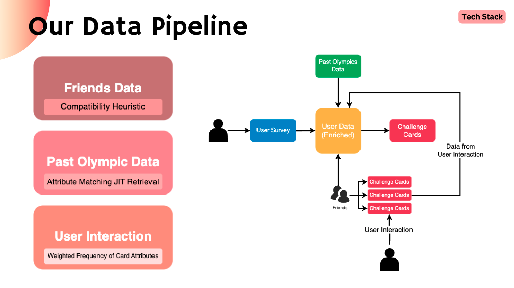
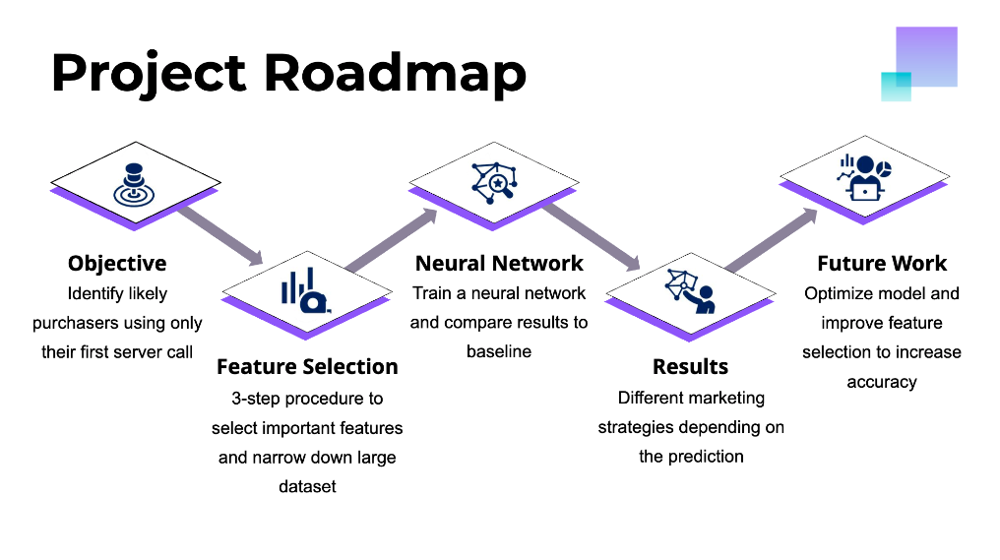
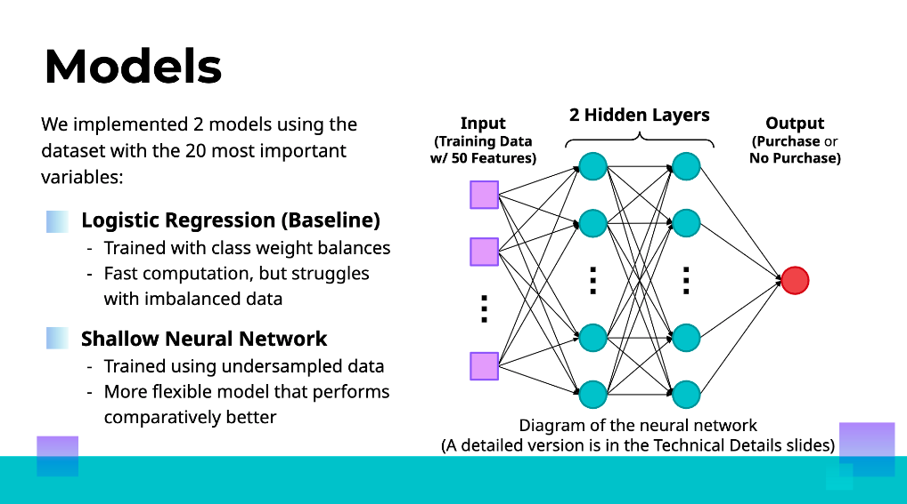
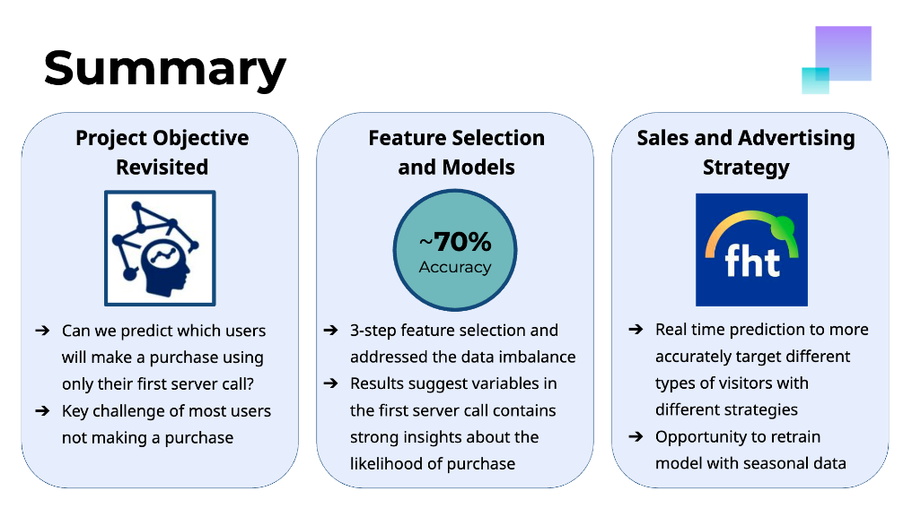

# Welcome to my Website!

I am a Data and Technology Associate Consultant at PwC, where I conduct data science and engineering for our private equity & capital markets value creation practice.
I am passionate about innovative practices for data management and analytics, and effectively commmunicating tangible results of data driven insights!

Feel free to look through my projects and reach out through my [linkedin](https://www.linkedin.com/in/toriwang)!
* * *

## Personal and Academic Projects

### UCLA, AWS, and Slalom Innovation Challenge
#### _Project Manager, Data Research Lead_

I was part of a 7 person student team in an Innovation Challenge sponsored by AWS, Slalom, the UCLA Epicenter for Action Research, and the 2024 Olympic planning committee. We were prompted to create an application aimed towards fostering online engagement for the 2024 Summer Olympics. 

We created an innovative application, designed to revolutionize how users engage with the Olympic Games. By leveraging a suite of cutting-edge technologies from Amazon Web Services (AWS), we designed our platform to deliver a uniquely personalized digital experience that's both dynamic and engaging.

I had such a fun time with my teammates, and our team ended up winning which gave us the opportunity to present our presentation to the Olympic Planning Committee! It was a great experience and we were even featured on UCLA newsroom.

#### Here are some previews of our Pitch Deck. View the full presentation [here]("pdfs/Team5-DataRangers-Pitch-Deck.pdf").

### FingerHut Retail User Analysis
#### _Project Manager, Data Scientist_

As part of the Capstone Course for the Data Theory Major, students must conduct a comprehensive project with an industry partner. For my project, I worked in a team of 4 to conduct customer analysis for an online retail store named FingerHut. FingerHut's mission was to make shopping for higher end products accessible to those with lower credit scores through pay over time and discounting strategies. FingerHut was interested in how webpage click data could be utilized towards optimizing advertisements, recommendations, and discounting strategies. 

As part of our project, my team developed a Python-based workflow to analyze server calls on a retail website over a 3 month timeframe, and conducted feature selection on variables, extracting and cleaning 5% of total metrics to use in model creation. We then created a baseline logistic regression model, and a neural network that achieved 70% accuracy in predicting eventual customer purchase. We presented our findings around the customer experience and purchase prediction to recommend advertising strategies to FingerHut.

#### Here are some previews of our presentation. View the full presentation [here]("pdfs/M148-Slide-Deck.pdf").

* * *
## Work Experience

### PwC Consulting Services
#### _Data and Technology Solutions Consultant_

* Managed ETL processes in SSMS (SQL), Alteryx, and Azure Data Factory to organize client financial data into meaningful schemas for future analytical processing and business needs reporting through Power BI.
* Created statistical models including customer churn analysis, transaction allocation, and product resegmentation through historical transaction data analysis in Python and Databricks.
* Managed feature creation and user testing for a client facing application targeting job leveling. This application is built by the Data and Technology team at PwC, and aided in deals valued at $4.7B+, capturing value through employee restructuring.

### PwC Consulting Services	
#### _Data and Technology Solutions Consultant Intern_

* Created ETL pipeline for transaction datasets for an M&A deal valuing 3.9B+ using Python, SQL, and Azure tools, transforming data into actionable insights to support strategic decision-making processes.
* Investigated key performance indicator (KPI) movements and interpret trends within evolving datasets, and communicated business strategies through visualizations and dashboards in Power BI.

### Binance - Swipe Division
#### _Risk and Compliance Consultant Intern_

* Conducted research and analyzed customer behavior data to identify risks and opportunities.
* Contributed to improving compliance policies and optimizing product offerings.
* Provided insights for finance and compliance teams, leveraging quantitative analysis of quarterly compliance testing to refine company risk management processes and optimize product design.

### UCLA Office of Residential Life
#### _Lead Residential Advisor_

* Serve as live-in advisor for 93 UCLA students to create an inclusive, healthy, safe residential community
* Mediate roommate conflicts, host floor meetings, and plan events to promote connectivity (dinners, socials)
* Provide guidance and resources to support residents through academic, social, and mental health challenges

* * *
## Education
### University of California, Los Angeles (2020-2024)
Honors College Candidate for B.S. in Data Theory

_Relevant Coursework_: Optimization, Data Analysis, Statistical Methods, Machine Learning, Computer Science

_Activities_: Consultant, International Bruins in Business; Project Lead, ArtReach UCLA
* * *

## Passions and Skills
### Passions
* Hiking and Backpacking, Coooking, and Gymnastics!

  
### Skills
* Data Management : ETL Processes, Relational Databases, OLTP & OLAP work-streams*
* Analytics & Visualization: Machine Learning Algorithms, Customer Churn, Product Segmentation
* Tools & Applications: Python, SQL, RStudio, Tableau, Alteryx, Jupyter Notebooks, Azure AI Services
* Certifications: Azure Fundamentals, Azure Data Fundamentals, Alteryx Designer Core 

