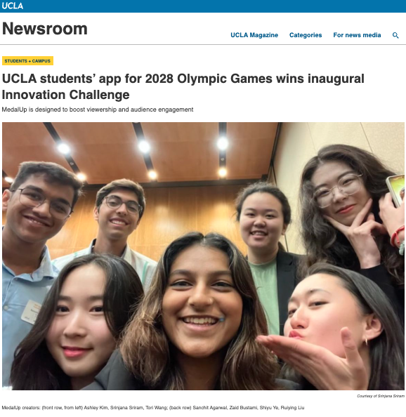
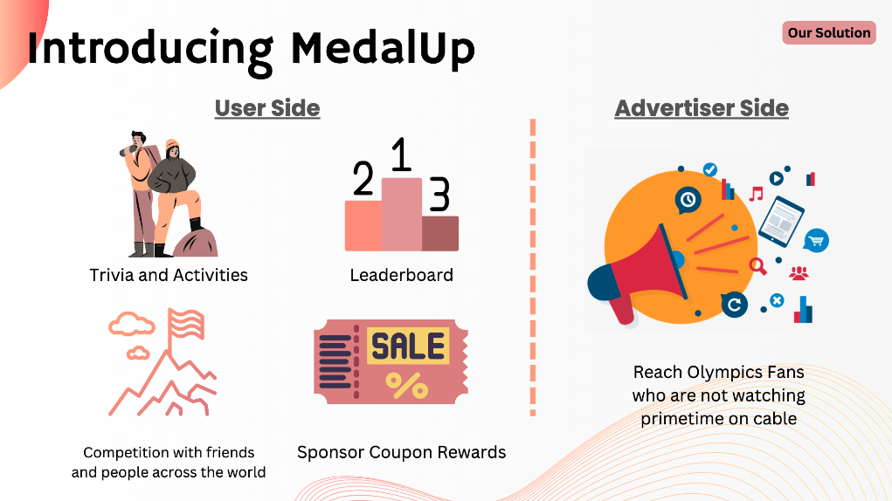
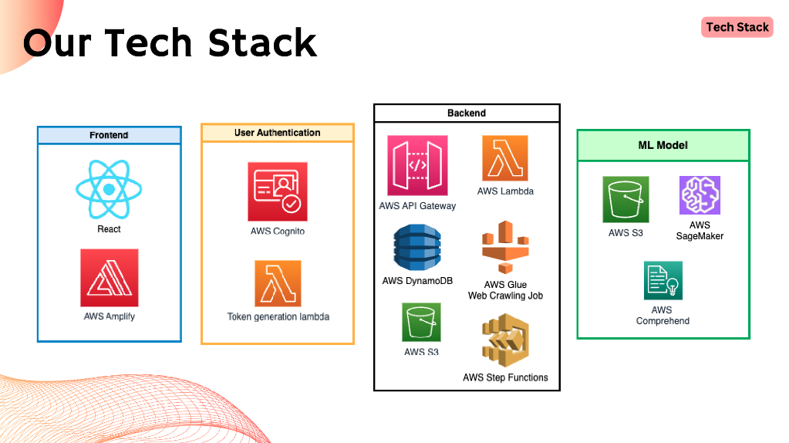
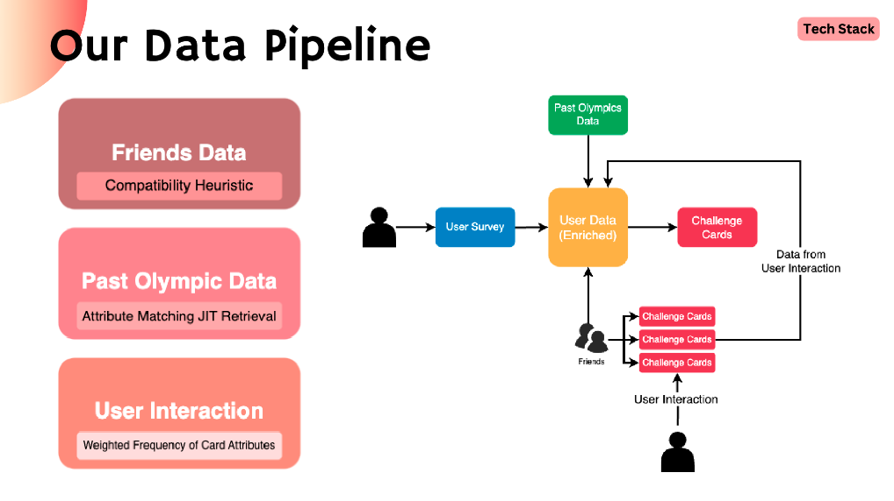
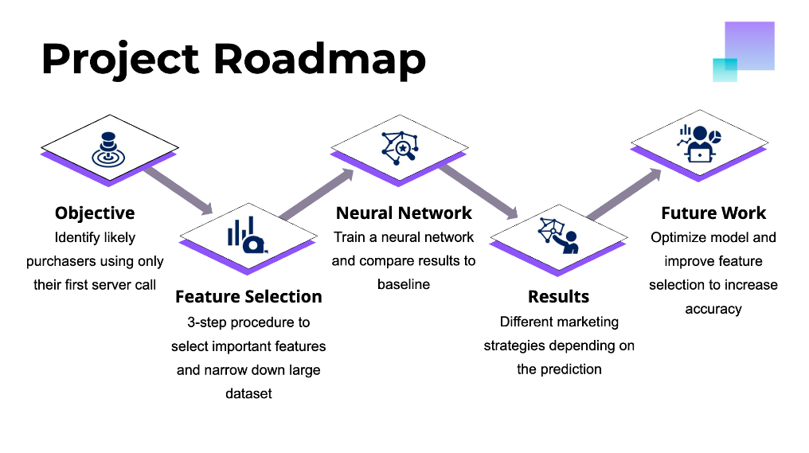
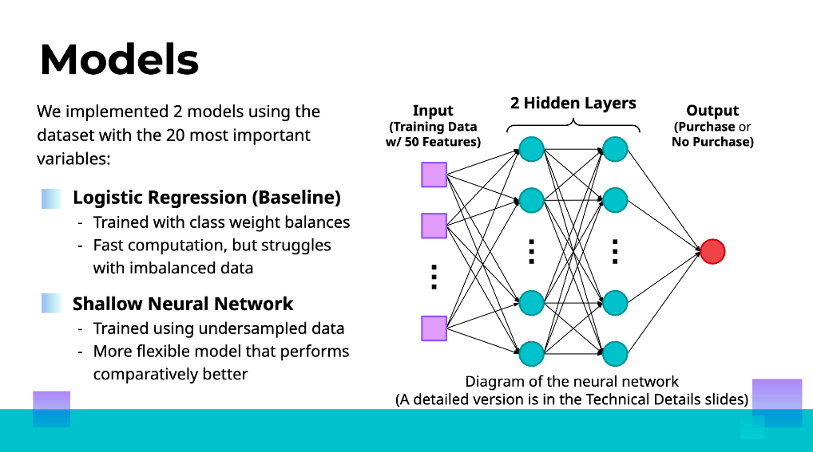
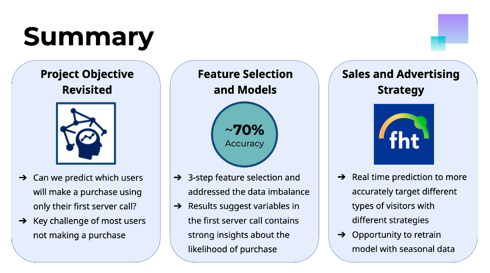

# Welcome to my Website!

I am a detail oriented Data Science Consultant at PwC with experience in machine learning, data science, and statistical modeling. I have proven ability in data-driven decision-making, supporting multi-billion dollar M&A deals, and am skilled in utilizing ML models to analyze large-scale unstructured data sets. Expertise in Databricks for customer
churn analysis and KPI trend tracking, as well as Azure cloud services for PostgreSQL database management and application integration. I am passionate about innovative practices for data management and analytics, and effectively commmunicating tangible results of data driven insights!

Feel free to look through my projects and reach me through my [linkedin](https://www.linkedin.com/in/toriwang)!
* * *

## Resume
<iframe src="pdfs/Tori_Wang_Resume.docx.pdf" width="100%" height="600px">
    
This browser does not support PDFs. Please download the PDF to view it: 
    <a href="pdfs/Tori_Wang_Resume.docx.pdf">Download PDF</a>.

</iframe>

* * *

## Personal and Academic Projects

## UCLA, AWS, and Slalom Innovation Challenge
#### _Project Manager, Data Research Lead_

I was part of a 7 person student team in an Innovation Challenge sponsored by AWS, Slalom, the UCLA Epicenter for Action Research, and the 2024 Olympic planning committee. We were prompted to create an application aimed towards fostering online engagement for the 2024 Summer Olympics. 

We created an innovative application, designed to revolutionize how users engage with the Olympic Games. By leveraging a suite of cutting-edge technologies from Amazon Web Services (AWS), we designed our platform to deliver a uniquely personalized digital experience that's both dynamic and engaging.

I had such a fun time with my teammates, and our team ended up winning which gave us the opportunity to present our presentation to the Olympic Planning Committee! It was a great experience and we were even featured on [UCLA newsroom](https://newsroom.ucla.edu/stories/ucla-students-app-for-2028-olympic-games).

## FingerHut Retail User Analysis
#### _Project Manager, Data Scientist_

As part of the Capstone Course for the Data Theory Major, students must conduct a comprehensive project with an industry partner. For my project, I worked in a team of 4 to conduct customer analysis for an online retail store named FingerHut. FingerHut's mission was to make shopping for higher end products accessible to those with lower credit scores through pay over time and discounting strategies. FingerHut was interested in how webpage click data could be utilized towards optimizing advertisements, recommendations, and discounting strategies. 

As part of our project, my team developed a Python-based workflow to analyze server calls on a retail website over a 3 month timeframe, and conducted feature selection on variables, extracting and cleaning 5% of total metrics to use in model creation. We then created a baseline logistic regression model, and a neural network that achieved 70% accuracy in predicting eventual customer purchase. We presented our findings around the customer experience and purchase prediction to recommend advertising strategies to FingerHut.

* * *
* * *
## Education
### University of California, Los Angeles (2020-2024)
Honors College Candidate for B.S. in Data Theory

_Relevant Coursework_: Optimization, Data Analysis, Statistical Methods, Machine Learning, Computer Science

_Activities_: Consultant, International Bruins in Business; Project Lead, ArtReach UCLA
* * *

## Passions and Skills
### Passions
* Hiking and Backpacking, Cooking, and Gymnastics!

  
### Skills
* Data Management : ETL Processes, Relational Databases, OLTP & OLAP work-streams*
* Analytics & Visualization: Machine Learning Algorithms, Customer Churn, Product Segmentation
* Tools & Applications: Python, SQL, RStudio, Tableau, Alteryx, Jupyter Notebooks, Azure AI Services
* Certifications: Azure Fundamentals, Azure Data Fundamentals, Alteryx Designer Core 

